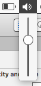

# volume
Bringing back the old volume slider to macOS.

## TODO
* observe volume for changes
* on right click or alt click, let the user change output device
* debounce scroll

## Notes
* Uses FA icons, png version created with http://fa2png.io
* [ISSoundAdditions](https://github.com/InerziaSoft/ISSoundAdditions)

## License
[MIT](https://tldrlegal.com/license/mit-license)
